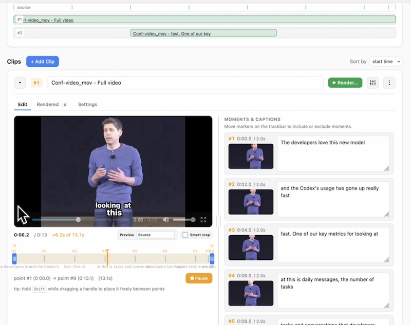
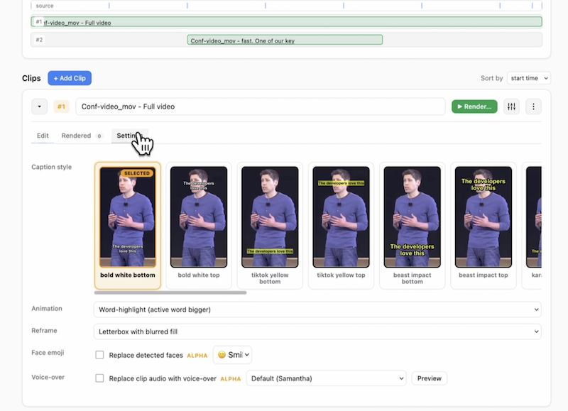
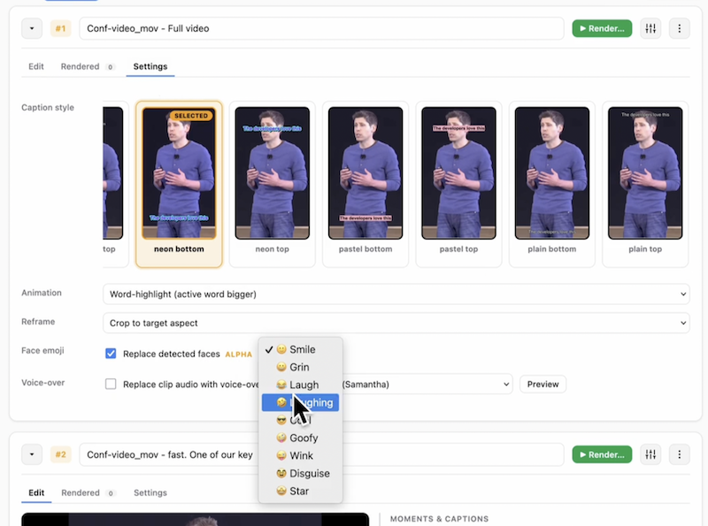

# AICW Video

AICW Video is an AI-powered editor for turning video recordings into short,
captioned social clips.

## Features

- **Create projects from folders** Add multiple videos and optional audio
  tracks in one project.
- **Match external audio** Automatically finds, syncs, and replaces a video's
  audio with the matching separate recording.
- **Suggest clips with AI** Analyzes videos and proposes short ranges to cut.
- **Generate editable captions** Creates speech captions with multiple static
  and word-highlight styles.
- **Caption silent videos** Uses AI scene analysis to describe videos without
  usable audio.
- **Preview before rendering** Review each clip with captions, crop, face emoji,
  and voice-over settings.
- **Export social formats** Render TikTok, Instagram Reels, YouTube Shorts,
  LinkedIn, Instagram feed, and YouTube landscape MP4s.
- **Privacy tools** Blur detected faces, optionally cover them with emoji, and
  replace clip audio with generated voice-over.

# Screenshots and demo  

**Screenshots**





**Video Demo:**

https://github.com/user-attachments/assets/3d1a97e8-9a6f-44fb-80d6-7a58f453ebe6


## Requirements

| Requirement | Notes |
| --- | --- |
| macOS / Mac OS X | Primary supported platform today. Windows support is planned. |
| 8 GB RAM or more | More RAM helps with longer source videos and parallel renders. |
| Node.js 20+ | Runtime for the CLI, MCP server, and web hub. |
| `ffmpeg` / `ffprobe` | Used for audio extraction, frame sampling, video probing, and rendering. |
| `whisper-cpp` | Used for local speech transcription. |
| Claude Code, Codex CLI, Ollama, or an MCP-capable AI host | Optional. Needed when AI scene analysis is enabled. Claude Code is the recommended/tested standalone path today. |

## How AI Is Used

AICW Video can run without cloud AI for basic transcription, local face
detection, face-focused crop hints, caption editing, and rendering. Speech
transcription uses `whisper-cpp`; face detection runs locally through the
JavaScript detector included with the app. It detects face regions for privacy
overlays; it does not identify people.

When you enable AI scene analysis, AICW Video can use the AI tools you already
have installed:

- **Claude Code / Claude CLI**: used through `claude --print` in standalone
  mode, or as an MCP host when AICW Video is connected to Claude Code.
- **Codex CLI**: can be used from Codex through MCP, and can also be configured
  as a standalone CLI fallback in `config.json`.
- **Ollama**: can be configured as a local standalone text AI fallback in
  `config.json`. The current built-in Ollama adapter is text-only, so visual
  frame descriptions still require Claude Code, Codex, or MCP host sampling.
- **MCP host sampling**: when AICW Video runs as MCP, visual frame analysis and
  caption proofreading use the parent app's model instead of spawning another
  AI CLI.

AI scene analysis is used for suggested clip ranges, keyframe labels,
silent-video visual captions, and optional caption proofreading. If it is off,
the app skips visual descriptions and uses Whisper plus local face detection.

Privacy note: local face detection never needs cloud AI. When you use Claude
Code, Codex, or another cloud-connected AI host, sampled frames, transcript
snippets, and caption text may be sent to that provider by the host tool. When
you use Ollama, that AI analysis runs through your local Ollama server.

### Advanced: Local Ollama

Ollama is useful if you want a local AI fallback for text-only steps today, and
it is the intended path for future local visual scene descriptions once the
AICW Video Ollama adapter accepts image frames.

```bash
brew install ollama
ollama serve
ollama pull qwen3-vl:8b
```

`qwen3-vl` is a vision-language model in Ollama:
<https://ollama.com/library/qwen3-vl>. For smaller machines, use a smaller tag
such as `qwen3-vl:4b` or `qwen3-vl:2b`. Then edit `config.json` if you want
Ollama to be the local text fallback:

```json
{
  "ai_cli_tools": [
    { "name": "ollama", "command": "ollama", "model": "qwen3-vl:8b", "supports_images": false }
  ]
}
```

Keep `supports_images` as `false` until image-capable Ollama support is added
to AICW Video. Use Claude Code, Codex, or MCP host sampling for visual scene
descriptions in the current release.

## Install AICW Video

### From Homebrew (after v1.0)

```bash
brew install aicw-io/tap/aicw-video
```

This pulls ffmpeg and whisper-cpp as dependencies. Release runbook:
[`docs/release/HOMEBREW.md`](docs/release/HOMEBREW.md).

### From Source

```bash
git clone https://github.com/aicw-io/aicw-video
cd aicw-video
./scripts/setup.sh
npm link
```

`scripts/setup.sh` is the recommended source install path. On macOS it installs
missing system dependencies with Homebrew, installs npm dependencies, builds the
app, and runs the preflight:

```bash
aicw-video doctor
```

The whisper model (`ggml-base.en.bin`, about 140 MB) downloads itself on first
use into `~/.cache/aicw-video/`.

If you do not want to link the command globally, run it from the clone:

```bash
node dist/cli.js doctor
node dist/cli.js home
```

For source development, these scripts build and start the browser hub:

```bash
bin/dev
bin/start
```

## Use AICW Video As MCP

AICW Video exposes a local stdio MCP server. Claude Code and Codex can use it to
create projects from video/audio files, analyze them, and return a local review
link. ChatGPT custom apps currently require a remote MCP server URL, so the
local stdio server is not directly usable from ChatGPT yet.

### Claude Code

From a source checkout:

```bash
cd /absolute/path/to/aicw-video
./scripts/setup.sh
claude mcp add aicw-video -- node /absolute/path/to/aicw-video/dist/cli.js mcp
claude mcp list
```

If you installed with `npm link`, you can register the global command instead:

```bash
claude mcp add aicw-video -- aicw-video mcp
```

Try it in Claude Code:

```text
Use aicw-video. Call ping_host with includeImage=true.
```

Then process a video:

```text
Use aicw-video to create a project from /path/to/video.mov, analyze it, then call review_project and give me the review link.
```

### Codex CLI

From a source checkout, first run:

```bash
cd /absolute/path/to/aicw-video
./scripts/setup.sh
```

Then edit `~/.codex/config.toml` and add:

```toml
[mcp_servers.aicw-video]
command = "node"
args = ["/absolute/path/to/aicw-video/dist/cli.js", "mcp"]
```

If you installed with `npm link`, this also works:

```toml
[mcp_servers.aicw-video]
command = "aicw-video"
args = ["mcp"]
```

Restart Codex, then try:

```text
Use aicw-video MCP. Call list_projects.
```

Then:

```text
Use aicw-video MCP to create a project from /path/to/video.mov, analyze it, then call review_project.
```

### ChatGPT Desktop / ChatGPT Developer Mode

ChatGPT custom MCP apps currently expect a remote MCP server URL using SSE or
streaming HTTP. AICW Video currently ships a local stdio MCP server:

```bash
aicw-video mcp
```

That means the ChatGPT Desktop custom connector screen cannot use the current
AICW Video MCP server directly. Do not paste `aicw-video mcp`,
`node dist/cli.js mcp`, or a `127.0.0.1` URL into ChatGPT's "Remote MCP server
URL" field.

For ChatGPT/OpenAI workflows today, use AICW Video through Codex CLI. Once AICW
Video adds a remote HTTP MCP mode, the ChatGPT setup will be:

1. Start or deploy the remote MCP server and get an HTTPS URL, for example:

   ```text
   https://your-domain.example.com/mcp
   ```

2. In ChatGPT, enable Developer Mode:

   ```text
   Settings -> Apps -> Advanced settings -> Developer mode
   ```

3. Open Apps settings, create a custom app from MCP, and use:

   ```text
   Name: AICW Video
   Remote MCP server URL: https://your-domain.example.com/mcp
   Authentication: No authentication or OAuth, depending on your deployment
   ```

4. In a chat, choose Developer Mode and select the AICW Video app. Then try:

   ```text
   Use AICW Video to create a project from /path/to/video.mov, analyze it, then call review_project.
   ```

OpenAI's current MCP docs describe ChatGPT custom apps as remote MCP servers
using SSE or streaming HTTP:
<https://platform.openai.com/docs/guides/developer-mode>.

You can also open the setup hub, which shows copy-paste snippets:

```bash
aicw-video home
```

## Start The App

```bash
aicw-video
```

The browser hub opens at `http://127.0.0.1:8764/`. From there you can create a
project, add videos and audio tracks, analyze sources, open each video plan, and
render clips.

From a source checkout, `npm start` runs `bin/start`, which builds the app and
starts the same browser hub.

## Typical Workflow

Files are stored in the AICW Video projects folder:

```text
~/aicw-video/projects/<project>/<video>/shorts/render-<timestamp>/
```

## Troubleshooting

- **`aicw-video doctor` shows a missing `whisper-cli`:** install whisper.cpp
  with `brew install whisper-cpp`.
- **Hub says "error: Load failed" when opening a project:** first plan builds can
  take a short while because AICW Video generates frame and caption-style
  previews. Reopen after the build finishes.
- **Port 8764 is busy:** the hub scans nearby ports. Check terminal output for
  the actual URL.

## Caveats

- macOS is the supported platform today; Windows support is planned.
- Per-clip voice-over is alpha, macOS-only today, and uses the system text-to-speech engine.
- Caption preview in the plan UI is approximate; the final ffmpeg/libass render
  is authoritative.

## Contributing & License

PRs welcome. See [`CONTRIBUTING.md`](CONTRIBUTING.md).

AICW Video is licensed under AGPL-3.0. See [LICENSE](LICENSE).
