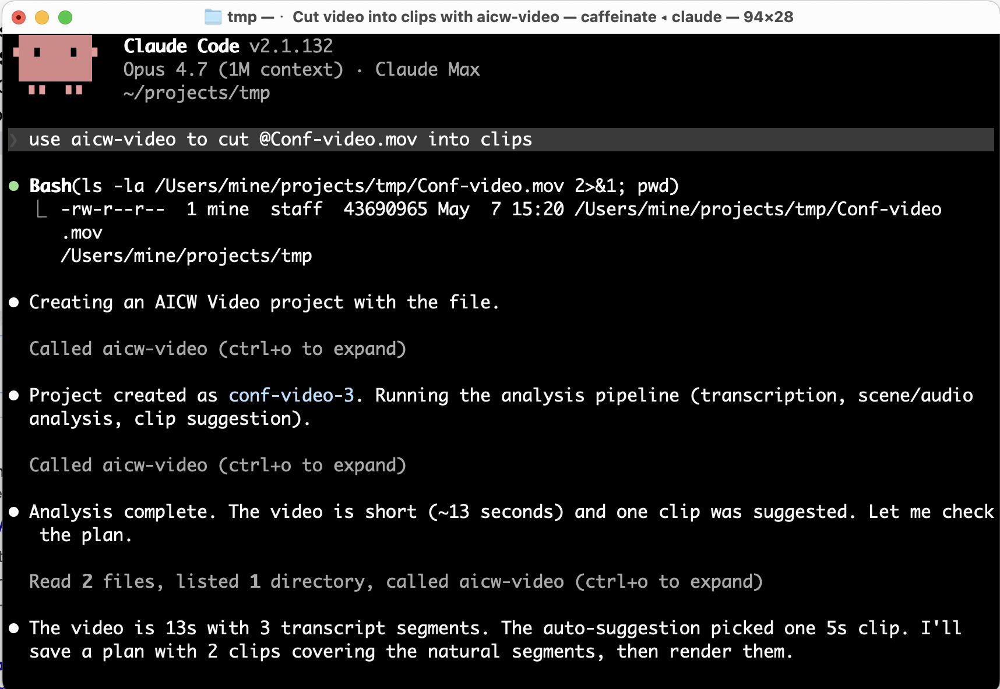
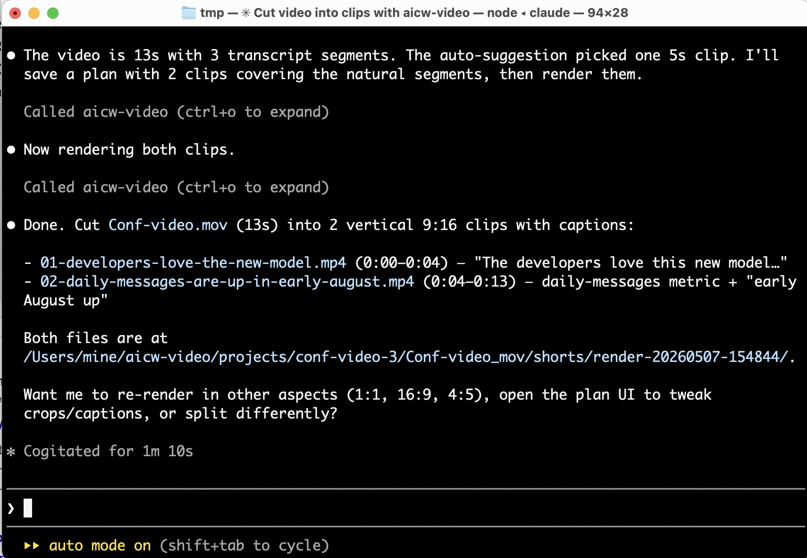
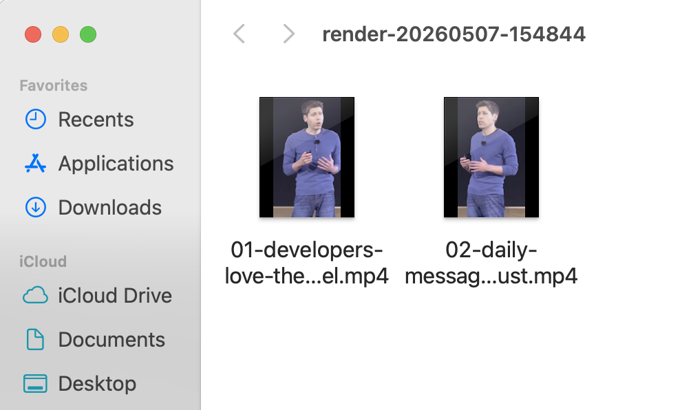

# AICW Video

AICW Video is an AI-powered editor for turning video recordings into short,
captioned social clips.

## Quick Links

- [Install](#install-aicw-video)
- [Start the app](#start-the-app)
- [Use from Claude, Codex, or ChatGPT](#use-from-ai-apps)
- [Privacy and AI use](#how-ai-is-used)
- [Troubleshooting](#troubleshooting)

## Features

- **Create projects from assorted video and audio** Drop multiple video files and separately recorded audio tracks if any.
- **Auto-matches audio tracks** Auto detects, matches and syncs audio to parent video.
- **Auto-suggests clip moments with AI** Analyzes videos to find key moments for short ranges to cut.
- **Generates captions** Creates speech captions, previews them and renders to final video
- **Caption silent videos** Uses AI scene analysis to describe videos without
  usable audio.
- **Preview before rendering** Review each clip before rendering
- **Export social formats** TikTok, Instagram Reels, YouTube Shorts,
  LinkedIn, Instagram feed, and YouTube landscape MP4s.
- **Privacy tools** Blur or replace faces, replace original audio with generated voice-over.

## Screenshots And Demo

**Screenshots**


**Video Demo:**

https://github.com/user-attachments/assets/0044971a-9da1-4b01-97d3-a0329eb3157f


## Requirements

| Requirement | Notes |
| --- | --- |
| macOS / Mac OS X | Primary supported platform today. Windows support is planned. |
| 8 GB RAM or more | More RAM helps with longer source videos and parallel renders. |
| Node.js 20+ | Runtime for the CLI, MCP server, and web hub. |
| `ffmpeg-full` / `ffprobe` | Used for local audio extraction, frame sampling, video probing, and rendering. Caption rendering requires ffmpeg's libass/subtitles filter. |
| `whisper-cpp` | Used for local speech transcription. |
| `tensorflow` | (auto-installed as library) used for local faces detections
| AI: Claude Code, Claude Desktop, Codex CLI, or Ollama; ChatGPT requires remote MCP mode | Optional. Needed when AI scene analysis is enabled. Claude Code is the recommended/tested standalone path today. |

## Install AICW Video

### From Homebrew

```bash
brew install aicw-io/tap/aicw-video
```

Homebrew pulls Node.js, ffmpeg-full, and whisper-cpp as dependencies. Release runbook:
[`docs/release/HOMEBREW.md`](docs/release/HOMEBREW.md).

To install the development build from the upstream `main` branch:

```bash
brew install --HEAD aicw-io/tap/aicw-video
```

### From Source

```bash
git clone https://github.com/aicw-io/aicw-video
cd aicw-video
./scripts/setup.sh
npm link
```

`scripts/setup.sh` is the recommended source install path. On macOS it installs
missing system dependencies with Homebrew, installs npm dependencies, builds the
app, and runs the preflight:

```bash
aicw-video doctor
```

The whisper model (`ggml-base.en.bin`, about 140 MB) downloads itself on first
use into `~/.cache/aicw-video/`.

If you do not want to link the command globally, run it from the clone:

```bash
node dist/cli.js doctor
node dist/cli.js home
```

For source development, these scripts build and start the browser hub:

```bash
bin/dev
bin/start
```

## Start The App

```bash
aicw-video
```

The browser hub opens at `http://127.0.0.1:8764/`. From there you can create a
project, add videos and audio tracks, analyze sources, open each video plan, and
render clips.

From a source checkout, `npm start` runs `bin/start`, which builds the app and
starts the same browser hub.

## Use From AI Apps

AICW Video ships a local stdio MCP server. Claude Code, Claude Desktop, and
Codex can call it to import a video, analyze it, create a plan, and render clips.

```bash
aicw-video setup-mcp
```

| Host | Setup | Notes |
| --- | --- | --- |
| Claude Code | `claude mcp add aicw-video -- aicw-video mcp` | Recommended path. |
| Claude Desktop | Add the JSON from `aicw-video setup-mcp` to `claude_desktop_config.json`. | Quit with Cmd+Q, then relaunch. |
| Codex CLI | Add the TOML from `aicw-video setup-mcp` to `~/.codex/config.toml`. | Restart Codex. |
| ChatGPT / ChatGPT Desktop | Requires a remote MCP server URL using SSE or streaming HTTP. | Local `aicw-video mcp` is stdio, so use Codex CLI for OpenAI local-MCP workflows today. |

Prompt example:

```text
use aicw-video to cut /path/to/video.mov into clips
```

Claude Code can run the whole flow and return the output folder:






ChatGPT Developer Mode currently documents remote MCP support, not local stdio
commands: <https://platform.openai.com/docs/guides/developer-mode>.

## Typical Workflow

Files are stored in the AICW Video projects folder:

```text
~/aicw-video/projects/<project>/<video>/shorts/render-<timestamp>/
```

## Troubleshooting

- **`aicw-video doctor` shows a missing `whisper-cli`:** install whisper.cpp
  with `brew install whisper-cpp`.
- **Hub says "error: Load failed" when opening a project:** first plan builds can
  take a short while because AICW Video generates frame and caption-style
  previews. Reopen after the build finishes.
- **Port 8764 is busy:** the hub scans nearby ports. Check terminal output for
  the actual URL.

## Caveats

- macOS is the supported platform today; Windows support is planned.
- Per-clip voice-over is alpha, macOS-only today, and uses the system text-to-speech engine.
- Caption preview in the plan UI is approximate; the final ffmpeg/libass render
  is authoritative.

## How AI Is Used

AICW Video is processing **locally** the following:
- audio and video extraction
- audio to text (via whisper local mode)
- face detection (via local tensorflow, used for privacy features)

Uses **cloud** but can also use **local** LLM: 
When you enable AI scene analysis, AICW Video can use the AI tools you already
have installed:

- **Claude Code / Claude CLI**: used through CLI
- **Codex CLI**: can be used through CLI
- **Ollama**: can be configured as a local AI fallback in
  `config.json`. The current built-in Ollama adapter is text-only, so visual
  frame descriptions still require Claude Code, Codex, or an MCP host that supports sampling.
- **MCP host sampling**: Claude Code, Claude Desktop, and Codex can call the
  local MCP server; ChatGPT requires a remote MCP URL.

AI scene analysis is used for: suggested clip ranges, keyframe labels,
silent-video visual captions, and optional caption proofreading. When it is off,
the app skips visual descriptions and uses local Whisper plus local face detection.

**Privacy note:** local face region detection never needs cloud AI. But note that when you use Claude
Code, Codex, or another cloud-connected AI host for describing a video, sampled frames, transcript
snippets, and caption text may be sent to that provider by the host tool. 

If you need full local AI only, then configure Ollama with local LLM like Qwen or Gemma (see below)

### Advanced: Local Ollama

Ollama is useful if you want a local AI fallback for text-only steps today, and
it is the intended path for future local visual scene descriptions once the
AICW Video Ollama adapter accepts image frames.

```bash
brew install ollama
ollama serve
ollama pull qwen3-vl:8b
```

`qwen3-vl` is a vision-language model in Ollama:
<https://ollama.com/library/qwen3-vl>. For smaller machines, use a smaller tag
such as `qwen3-vl:4b` or `qwen3-vl:2b`. Then edit `config.json` if you want
Ollama to be the local text fallback:

```json
{
  "ai_cli_tools": [
    { "name": "ollama", "command": "ollama", "model": "qwen3-vl:8b", "supports_images": false }
  ]
}
```

Keep `supports_images` as `false` until image-capable Ollama support is added
to AICW Video. Use Claude Code, Codex, or MCP host sampling for visual scene
descriptions in the current release.

## Contributing & License

PRs welcome. See [`CONTRIBUTING.md`](CONTRIBUTING.md).

AICW Video is licensed under AGPL-3.0. See [LICENSE](LICENSE).
